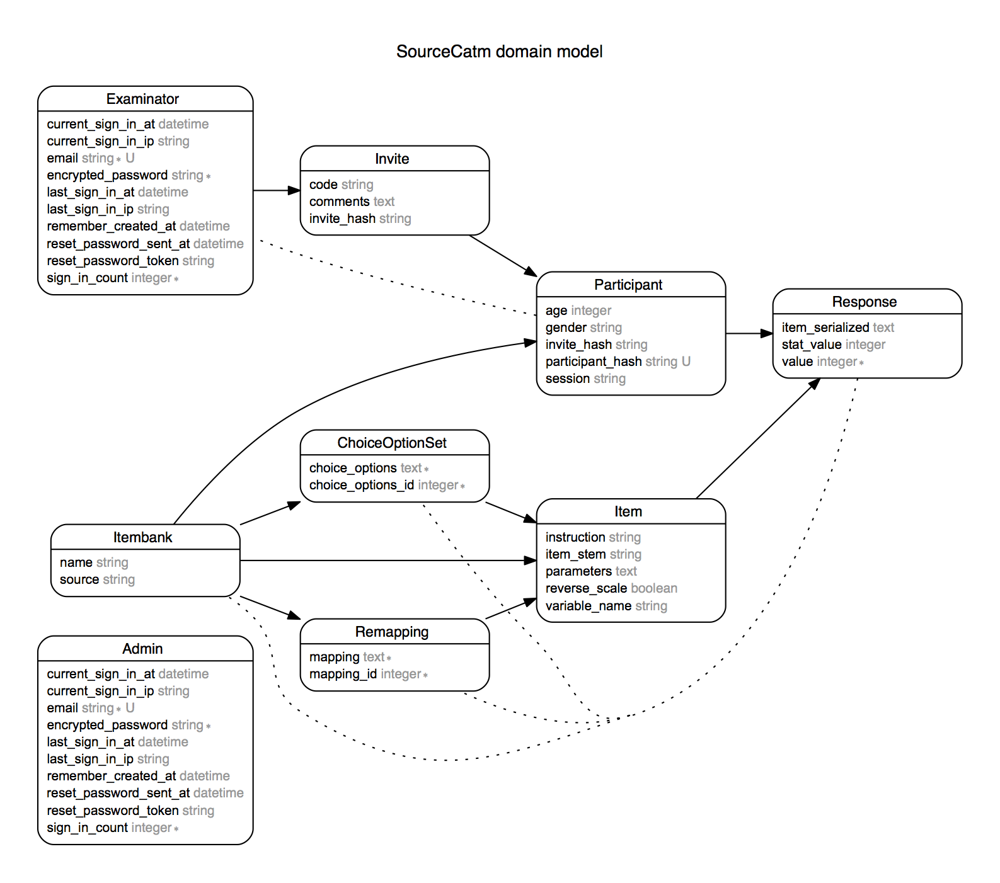

# MultiCAT GUI README

## Introduction

This is the sourcecode of a webbased MultiCAT UI. It is a basically a frontend and store for the MultiCAT/ShadowCAT developped by [Karel Kroeze](https://github.com/karel-kroeze).

This GUI has been developed as a proof of concept, but it is not a well rounded product yet. Although I made some effort to supporting different tests, it is currently supporting just one, with some hard coded specifics still around.

So hereby I grant you the right to add so free of charge (and guarantees :o ), or if you're interested in a MultiCAT GUI yourself but you can't program ruby, hire me to develop it further for you :)

Maarten
murb

## Documentation

The most important functions have been annotated, and you'll find the docs in the source. Additionally there is some end-user documentation available when running the application under /docs (in Dutch only).

## Ruby version

MultiCAT GUI has been tested on:
* ruby version 2.1 (2.1.5)
* R version >3 (3.1.3)

Gems and other dependencies are managed through bundler. Run `bundle install` to install all other dependencies.

## Basic domain model

The domainmodel below depicts how models are related. Rails, using [ActiveRecord](http://guides.rubyonrails.org/active_record_basics.html), has a strong coupling between model and storage of the model's values in the database.

## TODO

* The MultiCAT doesn't support multiple CAT-configurations yet, although much is in place to support this.

